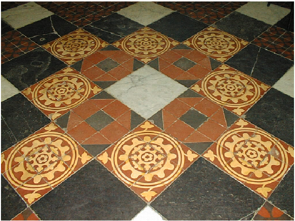
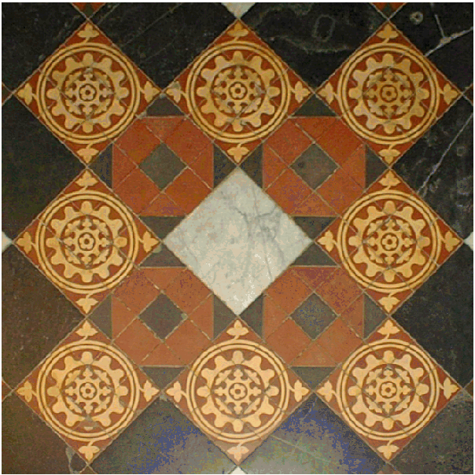
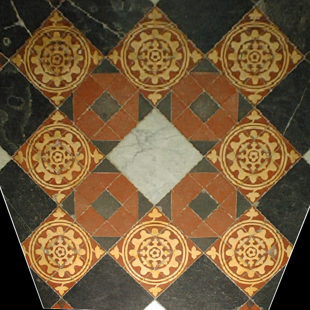
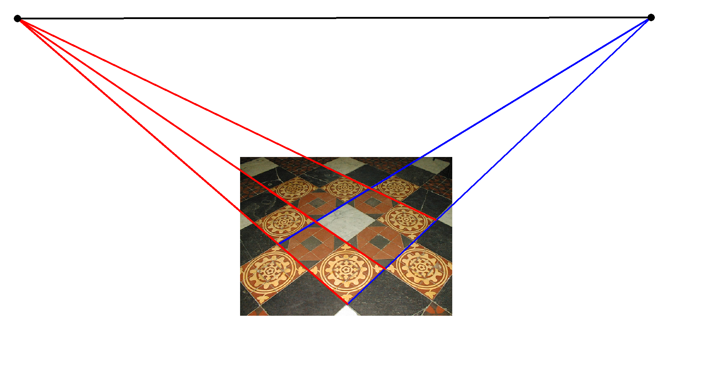
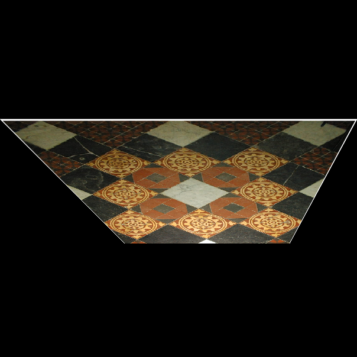

# Multiple View Geometry Code 

Code about MVG

## Compute Homography

```python
from algorithm import compute_homography
```

```
basic_dlt(point_list1,point_list2)
normilized_dlt(point_list1,point_list2)
```

<table border=0 cellspacing=0 cellpadding=0>
<tr><td></td><td></td>
  <td></td>
  </tr>
  <tr><td><div align="center">persp</div></td>
    <td><div align="center">fronto</div></td>
    <td><div align="center">result</div></td>
  </tr>
</table>

## Affine Rectification

Transform the vanishing line to its canonical form ^T)

```python
from algorithm import affine_rectification
```

```
rectify(img, parallel_A, parallel_B, H_A=None, debug=False)
```

<table border=0 cellspacing=0 cellpadding=0>
<tr><td></td><td></td>
  </tr>
  <tr><td><div align="center">vanishing line</div></td>
    <td><div align="center">rectified</div></td>
  </tr>
</table>

